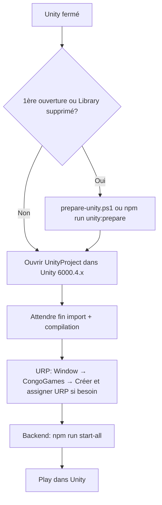

# Guide : lancement Unity, dossier `Library` et ce qui se régénère

Ce document condense l’essentiel pour ouvrir le projet Unity, comprendre le dossier `Library` et l’ordre des actions. Pour la boucle complète backend + TTS + Play, voir [TESTER.md](TESTER.md) et le [README à la racine](../README.md).

## De quoi parle-t-on quand on dit « la librairie » ?

Dans le contexte de ce dépôt, c’est en pratique le dossier **[`UnityProject/Library/`](../UnityProject/)** (cache Unity) — **il n’est pas dans Git** (voir [`.gitignore`](../.gitignore) : `Library/`, `Temp/`, `obj/`, etc.). Ce n’est pas un fichier unique « bibliothèque » : c’est tout le cache local qu’Unity crée sur **votre machine** pour compiler, importer les assets et résoudre les packages.

- **S’il n’existe pas** (clone frais, ou vous l’avez supprimé) : à la prochaine ouverture du projet, Unity le **reconstruit** (import + compilation) — c’est **long** la première fois, c’est normal.
- **À chaque lancement d’Unity** : le dossier est **réutilisé** et mis à jour (pas tout recréer from scratch à chaque fois, sauf nettoyage).
- **`Temp/`** : fichiers temporaires de session ; souvent supprimé avec `Library` en cas de cache incohérent (voir [TESTER.md](TESTER.md)).

Autre sens possible : les **paquets** Unity (`Packages/manifest.json` — versionné) et le **PackageCache** sous `Library/PackageCache` : ce contenu vient de la résolution des packages ; en cas d’avertissement **« immutable packages were unexpectedly altered »** (URP), le [README](../README.md) indique que c’est **souvent attendu** après les correctifs URP, et de relancer le script de préparation après une mise à jour de paquet ou une suppression de `Library`.

## Ordre d’actions recommandé (clair)

1. **Avec Unity fermé** : si c’est la **première ouverture** ou que vous avez supprimé `UnityProject/Library`, exécuter depuis la racine du dépôt : **`.\prepare-unity.ps1`** (Windows) ou `npm run unity:prepare` — cela applique le patch des menus URP (Unity 6.4), comme indiqué dans le [README](../README.md) et le script [`prepare-unity.ps1`](../prepare-unity.ps1).
2. **Ouvrir** le dossier `UnityProject/` dans l’éditeur Unity **6000.4.x** (version attendue : [`ProjectVersion.txt`](../UnityProject/ProjectSettings/ProjectVersion.txt) — ex. 6000.4.3f1).
3. **Attendre** la fin de l’import et de la compilation (barre de progression, pas d’icône de compilation en boucle).
4. **URP** : menu **Window → CongoGames** (ou **Tools → CongoGames**) — **Créer et assigner URP** si le rendu / le menu n’est pas en place.
5. **Boucle jeu** : lancer le backend (voir le [README](../README.md) : `cd Backend` puis `npm run dev`, ou `npm run start-all` à la racine) ; dans Unity, **Play** (comportement détaillé dans [TESTER.md](TESTER.md) — `RuntimeBootstrap`, TTS, `demo:local`).

## Fichiers versionnés vs régénérés (référence rapide)

| Élément | Rôle | Versionné Git ? |
|--------|------|-----------------|
| `UnityProject/Assets/`, `ProjectSettings/`, `Packages/manifest.json` | Projet, réglages, liste des paquets | Oui |
| `UnityProject/Library/`, `Temp/` | Cache local, compilation, PackageCache | **Non** (régénéré / mis à jour localement) |

## Si quelque chose « casse » après une régénération

La section **Play grisé / erreurs** de [TESTER.md](TESTER.md) décrit : Safe Mode, **Console** (filtrer les erreurs), **`Editor.log`** Windows (`%LOCALAPPDATA%\Unity\Editor\Editor.log`), puis **`prepare-unity.ps1` avec Unity fermé**, et en dernier recours **supprimer `Library` et `Temp`** puis rouvrir (toujours relancer `prepare-unity` après une suppression de `Library`). Cas particulier **Bee / PDB** : chemin de projet **sans emojis** dans le chemin Windows, exclusion antivirus de `Library`, espace disque (détail dans la même doc).

**Avertissement « Input Manager is deprecated »** : ce n’est **pas** l’explication d’un **Play** bloqué. Si seul ce message s’affiche en jaune, cherche ailleurs : **`Assets/csc.rsp`** (doit être vide sauf options Roslyn valides), **`Editor.log`** pour **`error CS`**, et cache **`Library` / `Temp`**.

## Résumé en une phrase

**Ne pas commiter `Library` ;** le script **`prepare-unity`** se lance **Unity fermé** **avant** (ou juste **après** avoir vidé) **`Library` ;** ouvrez **`UnityProject`**, laissez l’import finir, configurez l’**URP** via le menu **CongoGames**, démarrez le **backend** puis **Play** — c’est le flux documenté [README](../README.md) + [TESTER.md](TESTER.md).
